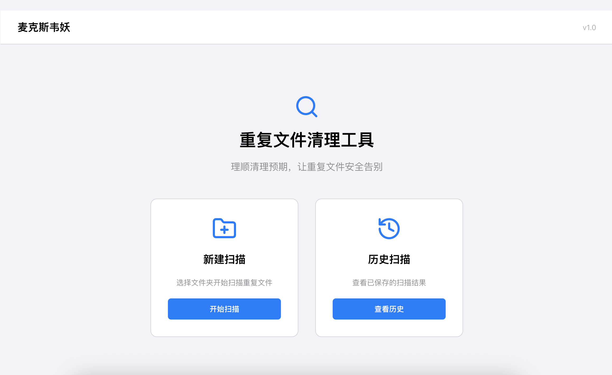
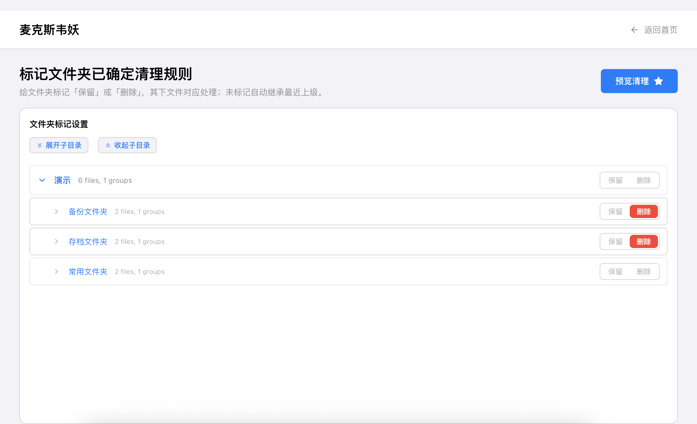
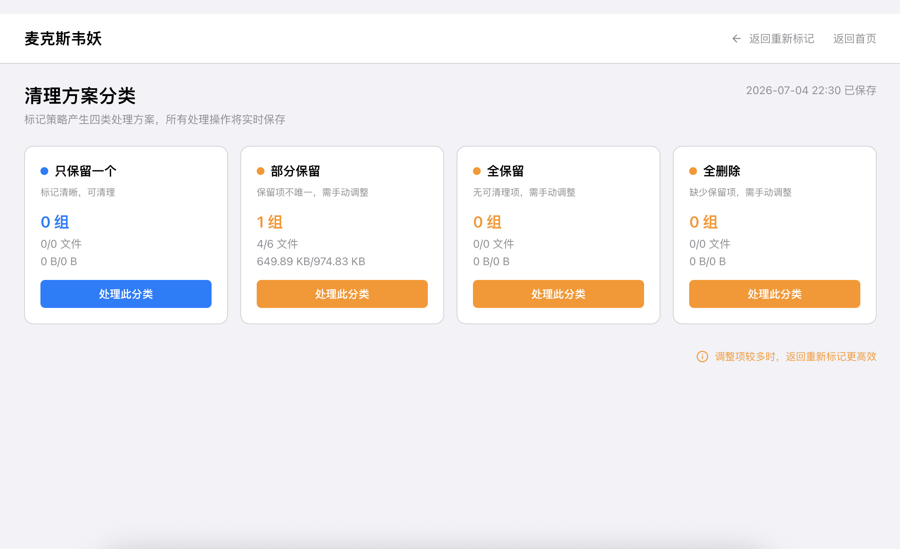

# Maxwell's Demon 👿

[](https://www.gnu.org/licenses/gpl-3.0)
[](https://www.docker.com/)

English | [简体中文](README.md)

**Maxwell's Demon** is a professional **duplicate file scanning and cleanup tool**. It completely subverts the "mental burden" and "fear of file loss" brought by traditional duplicate file cleaners.

> **⚠️ Compatibility Note:**
> The underlying architecture is designed to be compatible with Linux (Docker), macOS, and Windows. However, it has currently **only been fully tested manually on Synology NAS (Docker) and macOS (Local)**. It is highly optimized for NAS hardware. Regular users are strongly recommended to use Docker for deployment. Windows users are welcome to deploy and provide feedback!

---

## ✨ Why Choose Maxwell's Demon? (Solving Core Pain Points)

**The Pain Point:** Traditional duplicate file cleaning software usually offers two terrible ways to clean up after scanning massive amounts of files:
1. Forcing users to **manually check boxes** one by one in lists of thousands of files (time-consuming and frustrating).
2. Offering automated cleanup like "keep newest" or "keep oldest". However, this often **destroys your directory structure habits**. It might keep a file in an obscure backup folder you never use, while deleting the copy in your carefully organized "current working directory", causing you to lose track of your files later.

**Our Solution: Innovative "Directory-Level Marking Rules"**
Maxwell's Demon allows you to define strategies **by folder**. You only need to mark your frequently used, well-organized folders as "Keep", and mark messy download or backup directories as "Delete".
The system automatically inherits these rules down to all child files. This means **your files will always stay in the directory structure where you expect them to be**, while redundant copies are precisely eliminated!

## 🛠️ Other Technical Features

- 🛡️ **Safety-First Smart Classification & Red Line Protection**:
  - After you mark folders, the system automatically classifies the scan results into four categories: "Keep One", "Partial Keep", "Keep All", and "Delete All".
  - **Red Line Mechanism**: If a group of duplicate files, according to your folder rules, doesn't have at least *one* copy marked as "Keep", the system forcefully locks the deletion operation for that group. **The software will absolutely never delete the last surviving copy of your file.**
- 🚀 **Lightning-Fast Two-Stage Hash Scanning Engine**: Optimized for the limited CPU performance of a NAS. It utilizes a two-stage hash strategy with `xxHash64` (initial screening) + `SHA-256` (confirmation). High-intensity hashing is only performed when file sizes and initial hashes match perfectly, making scanning speeds far superior to traditional tools.
- 🐳 **Native Docker Support**: Provides a `docker-compose` one-click deployment solution, perfectly isolating the environment and safely mounting NAS storage volumes.
- 🖥️ **Modern UI**: Supports real-time WebSocket progress pushes and features an intuitive tree-directory display, bidding farewell to the rudimentary noodle-like lists of traditional software.

---

## 📸 Interface Preview

* **Home & Scan Configuration**
  

* **Scan Progress & Tree Marking Interface**
  

* **Smart Classification & Cleanup Confirmation Panel**
  

---

## 🚀 Quick Start (Docker, Recommended for NAS Users)

This is the fastest way to deploy Maxwell's Demon on a Synology NAS or any Linux server supporting Docker.

### 1. Get Code & Configuration

Clone this repository to your server:

```bash
git clone https://github.com/yourusername/maxwells-demon.git
cd maxwells-demon/engineering
```

### 2. Configure Storage Volumes (Mount your NAS)

Open the `docker-compose.yml` file, modify the `volumes` section, and replace `/volume1` with the actual NAS path you want to scan:

```yaml
services:
  backend:
    volumes:
      # Mount the host's /volume1 to /mnt/nas inside the container for scanning
      - /volume1:/mnt/nas
      # Database and configuration persistence
      - maxwells-demon-data:/app/data
```

### 3. One-Click Start

Execute in the `engineering` directory:

```bash
docker-compose up -d
```

Once started, open your browser and visit `http://YOUR_SERVER_IP:3080` to start using it!

*(Note: If macOS Sequoia users encounter browser blocking due to system security mechanisms, please enable "Local Network" permissions for your browser in System Settings.)*

---

## 💻 Local Development & Native Execution

If you wish to deploy natively on macOS/Windows or participate in secondary development, this project uses a frontend-backend separation architecture (Vue/React + FastAPI).

---

## 🤝 Contributing

Issues for bug reports and Pull Requests for new features and optimizations are welcome.
To run test cases, please refer to `QA/engineering/tests/README.md`.

---

## 📄 License

This project is licensed under the [GPL v3.0](LICENSE) License.
